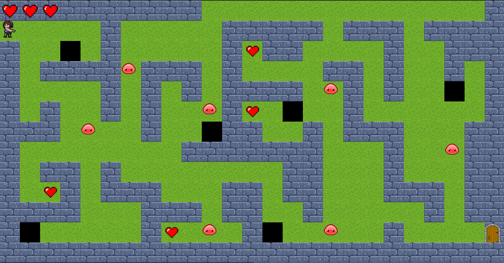

[](https://opensource.org/licenses/MIT)
# Lara Croft X Pacman

`Lara Croft X Pacman` is a labyrinth game developed with Java.





## Installation
### Prerequisites
You need [Maven](https://maven.apache.org/) to run this game.

## How to play

```bash
mvn compile
mvn exec:java -Dexec.mainClass=start.Main
```


## Support
If you encounter a problem, want to ask for help, or want to suggest a feature, feel free to [open an issue](https://github.com/ALICHOUCHENE/ACL2021-AMU/issues).

## Authors
This game started as a school project by [Maha Gaied](https://github.com/mahagaied), [Oumnia Anouk](https://github.com/WishAnk), [Moad Benslimane](https://github.com/MoadBens), [Mahdi Chaari](https://github.com/OriginalPou) and [Ali Chouchene](https://github.com/ALICHOUCHENE) 

# License
Lara Croft X Pacman is licensed under the [MIT license](LICENSE).